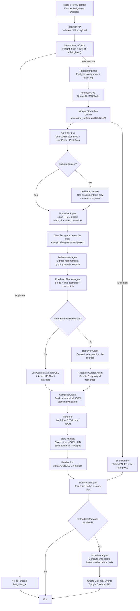

\*# Headstart Agentic Workflow (Mermaid)

## Flowchart (end-to-end: assignment → headstart doc → notify → calendar)

```mermaid
flowchart TD
  %% Headstart Agentic Workflow (Assignment -> Headstart Doc + Notification + Calendar)
  A[Trigger: New/Updated Canvas Assignment Detected] --> B[Ingestion API\n Validate JWT + payload]
  B --> C["Idempotency Check\n #40;content_hash + due_at + rubric_hash#41;"]
  C -->|Duplicate| C1[No-op / Update last_seen_at] --> Z[End]
  C -->|New Version| D[Persist Metadata\n Postgres: assignment + event log]
  D --> E[Enqueue Job\n Queue: BullMQ/Redis]
  E --> F["Worker Starts Run\n Create generation_run#40;status=RUNNING#41;"]

  %% Context gathering
  F --> G[Fetch Context\n Course/Syllabus Files + User Prefs + Past Docs]
  G --> H{Enough Context?}
  H -->|No| H1[Fallback Context\n Use assignment text only + safe assumptions]
  H -->|Yes| I[Normalize Inputs\n clean HTML, extract rubric, due date, constraints]
  H1 --> I

  %% Planning + tool routing
  I --> J[Classifier Agent Determine type: essay/coding/problemset/project]
  J --> K[Deliverables Agent\n Extract: requirements, grading criteria, outputs]
  K --> L[Roadmap Planner Agent\n Steps + time estimates + checkpoints]
  L --> M{Need External Resources?}
  M -->|No| N[Use Course Materials Only\n links to LMS files if available]
  M -->|Yes| O[Retriever Agent\n Curated web search + cite sources]
  O --> P[Resource Curator Agent\n Pick 5-10 high-signal resources]

  %% Composition
  N --> Q["Composer Agent\n Produce canonical JSON\n #40;schema validated#41;"]
  P --> Q
  Q --> R[Renderer\n Markdown/HTML from JSON]
  R --> S[Store Artifacts\n Object store: JSON + MD\n Save pointers in Postgres]
  S --> T[Finalize Run\n status=SUCCESS + metrics]

  %% Downstream actions
  T --> U[Notification Agent\n Extension badge + in-app alert]
  U --> V{Calendar Integration Enabled?}
  V -->|No| Z[End]
  V -->|Yes| W[Scheduler Agent\n Compute time blocks\n based on due date + prefs]
  W --> X[Create Calendar Events\n Google Calendar API]
  X --> Z[End]

  %% Error path
  F -->|Exception| E1[Error Handler\n status=FAILED + log\n retry policy]
  E1 --> U
```

-
