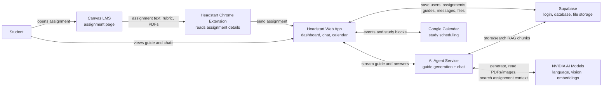

# Headstart Architecture - Poster Diagram

## What This Shows

Headstart starts inside Canvas, where the Chrome extension collects the assignment details a student is already viewing. The web app saves that assignment, shows the dashboard experience, and asks the AI agent service to generate a study guide or answer follow-up questions.

Supabase keeps the durable project data: accounts, assignments, uploaded files, guides, chat messages, and searchable RAG chunks. NVIDIA models power the AI responses, PDF/image understanding, and semantic search. Google Calendar is optional and is used for planning study sessions around assignment due dates.

## Main Idea

Headstart turns a Canvas assignment into an interactive study guide, then helps the student keep asking questions and schedule work time from one dashboard.
