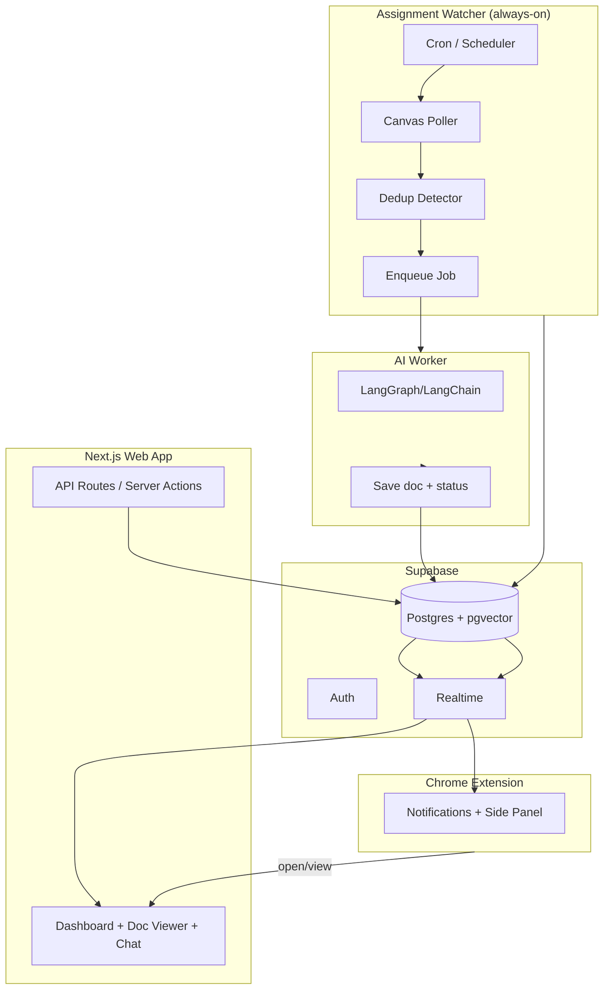

```mermaid
flowchart TB
  subgraph Ext[Chrome Extension]
    Notif["Notifications + Side Panel"]
  end

  subgraph Web["Next.js Web App"]
    API["API Routes / Server Actions"]
    UI["Dashboard + Doc Viewer + Chat"]
  end

  subgraph Watcher["Assignment Watcher (always-on)"]
    direction LR
    Cron["Cron / Scheduler"]
    Poll["Canvas Poller"]
    Dedup["Dedup Detector"]
    Enq["Enqueue Job"]
    Cron --> Poll --> Dedup --> Enq
  end

  subgraph Worker["AI Worker"]
    direction LR
    Orchestrator["LangGraph/LangChain"]
    Save["Save doc + status"]
  end

  subgraph Supa[Supabase]
    direction LR
    DB[("Postgres + pgvector")]
    Auth[Auth]
    RT[Realtime]
  end

  Ext -->|"open/view"| UI
  API --> DB
  Watcher --> DB
  Enq --> Worker
  Worker --> Save --> DB
  DB --> RT --> UI
  DB --> RT --> Notif
```
