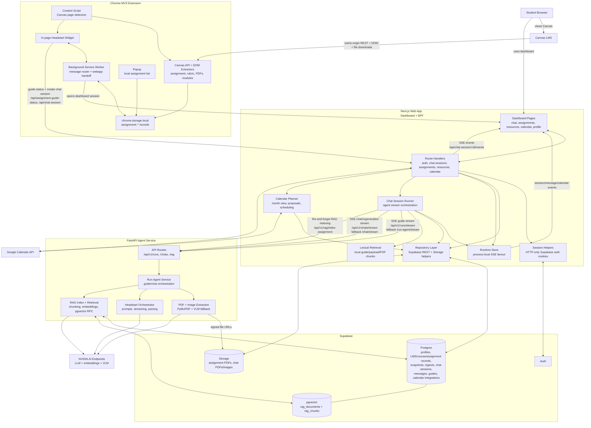

# Architecture Diagram

## Primary Flows

1. Canvas assignment pages are detected by the extension content script.
2. The extension extracts assignment data through Canvas REST APIs, DOM fallbacks, rubric parsing, module-resource lookup, and PDF downloads, then stores normalized records in `chrome.storage.local`.
3. The widget asks the web app whether a guide already exists. When the student starts a run, the background service worker posts the normalized payload to `POST /api/chat-session`.
4. The web app authenticates the user with Supabase Auth cookies, persists LMS/course/assignment/snapshot/session rows, deduplicates and uploads files to Supabase Storage, creates an in-memory runtime session, and starts the background runner.
5. The runner calls the FastAPI agent service over SSE. The agent service extracts PDF/image context, classifies the assignment, streams guide or chat deltas from NVIDIA-hosted models, and returns extracted file text and sources.
6. The web app relays progress to the dashboard through its own session SSE endpoint and persists final chat messages, guide versions, assignment category, PDF extraction text, and source metadata in Supabase.
7. The web app triggers RAG indexing fire-and-forget. The agent service chunks sources, embeds them with NVIDIA embeddings, and stores searchable chunks in Supabase pgvector tables.
8. Follow-up chat and guide regeneration are initiated from the dashboard. The web app builds context from durable session data, local lexical retrieval, optional RAG identifiers, optional uploaded files, and optional calendar context before calling the agent chat stream.
9. Calendar routes combine persisted assignment due dates with Google Calendar events, generate non-persistent study-block proposals, and schedule selected blocks directly in Google Calendar with private Headstart markers.

## Notes

- The extension does not call the Python agent service directly.
- The web app is the durable owner of session, guide, assignment, file, and dashboard state.
- The web app runtime store is process-local and only supports live SSE fanout; Supabase remains the source of truth after reloads or process restarts.
- Supabase Realtime is not part of the current dashboard update path.
- There is no always-on assignment watcher or separate worker queue in the current architecture.
