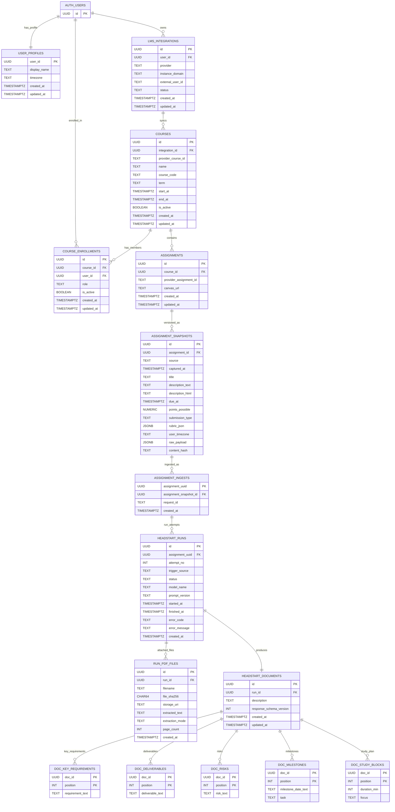

# Entity Relationship Diagram (Mermaid)

This diagram reflects the finalized BCNF schema in `docs/Entity Relationship Diagram.md`.

```mermaid
erDiagram
  AUTH_USERS {
    UUID id PK
  }

  USER_PROFILES {
    UUID user_id PK
    TEXT display_name
    TEXT timezone
    TIMESTAMPTZ created_at
    TIMESTAMPTZ updated_at
  }

  LMS_INTEGRATIONS {
    UUID id PK
    UUID user_id FK
    TEXT provider
    TEXT instance_domain
    TEXT external_user_id
    TEXT status
    TIMESTAMPTZ created_at
    TIMESTAMPTZ updated_at
  }

  COURSES {
    UUID id PK
    UUID integration_id FK
    TEXT provider_course_id
    TEXT name
    TEXT course_code
    TEXT term
    TIMESTAMPTZ start_at
    TIMESTAMPTZ end_at
    BOOLEAN is_active
    TIMESTAMPTZ created_at
    TIMESTAMPTZ updated_at
  }

  COURSE_ENROLLMENTS {
    UUID id PK
    UUID course_id FK
    UUID user_id FK
    TEXT role
    BOOLEAN is_active
    TIMESTAMPTZ created_at
    TIMESTAMPTZ updated_at
  }

  ASSIGNMENTS {
    UUID id PK
    UUID course_id FK
    TEXT provider_assignment_id
    TEXT canvas_url
    TIMESTAMPTZ created_at
    TIMESTAMPTZ updated_at
  }

  ASSIGNMENT_SNAPSHOTS {
    UUID id PK
    UUID assignment_id FK
    TEXT source
    TIMESTAMPTZ captured_at
    TEXT title
    TEXT description_text
    TEXT description_html
    TIMESTAMPTZ due_at
    NUMERIC points_possible
    TEXT submission_type
    JSONB rubric_json
    TEXT user_timezone
    JSONB raw_payload
    TEXT content_hash
  }

  ASSIGNMENT_INGESTS {
    UUID assignment_uuid PK
    UUID assignment_snapshot_id FK
    TEXT request_id
    TIMESTAMPTZ created_at
  }

  HEADSTART_RUNS {
    UUID id PK
    UUID assignment_uuid FK
    INT attempt_no
    TEXT trigger_source
    TEXT status
    TEXT model_name
    TEXT prompt_version
    TIMESTAMPTZ started_at
    TIMESTAMPTZ finished_at
    TEXT error_code
    TEXT error_message
    TIMESTAMPTZ created_at
  }

  RUN_PDF_FILES {
    UUID id PK
    UUID run_id FK
    TEXT filename
    CHAR64 file_sha256
    TEXT storage_uri
    TEXT extracted_text
    TEXT extraction_mode
    INT page_count
    TIMESTAMPTZ created_at
  }

  HEADSTART_DOCUMENTS {
    UUID id PK
    UUID run_id FK
    TEXT description
    INT response_schema_version
    TIMESTAMPTZ created_at
    TIMESTAMPTZ updated_at
  }

  DOC_KEY_REQUIREMENTS {
    UUID doc_id PK
    INT position PK
    TEXT requirement_text
  }

  DOC_DELIVERABLES {
    UUID doc_id PK
    INT position PK
    TEXT deliverable_text
  }

  DOC_RISKS {
    UUID doc_id PK
    INT position PK
    TEXT risk_text
  }

  DOC_MILESTONES {
    UUID doc_id PK
    INT position PK
    TEXT milestone_date_text
    TEXT task
  }

  DOC_STUDY_BLOCKS {
    UUID doc_id PK
    INT position PK
    INT duration_min
    TEXT focus
  }

  AUTH_USERS ||--|| USER_PROFILES : has_profile
  AUTH_USERS ||--o{ LMS_INTEGRATIONS : owns
  LMS_INTEGRATIONS ||--o{ COURSES : syncs
  AUTH_USERS ||--o{ COURSE_ENROLLMENTS : enrolled_in
  COURSES ||--o{ COURSE_ENROLLMENTS : has_members
  COURSES ||--o{ ASSIGNMENTS : contains
  ASSIGNMENTS ||--o{ ASSIGNMENT_SNAPSHOTS : versioned_as
  ASSIGNMENT_SNAPSHOTS ||--o{ ASSIGNMENT_INGESTS : ingested_as
  ASSIGNMENT_INGESTS ||--o{ HEADSTART_RUNS : run_attempts
  HEADSTART_RUNS ||--o{ RUN_PDF_FILES : attached_files
  HEADSTART_RUNS ||--|| HEADSTART_DOCUMENTS : produces
  HEADSTART_DOCUMENTS ||--o{ DOC_KEY_REQUIREMENTS : key_requirements
  HEADSTART_DOCUMENTS ||--o{ DOC_DELIVERABLES : deliverables
  HEADSTART_DOCUMENTS ||--o{ DOC_RISKS : risks
  HEADSTART_DOCUMENTS ||--o{ DOC_MILESTONES : milestones
  HEADSTART_DOCUMENTS ||--o{ DOC_STUDY_BLOCKS : study_plan
```
