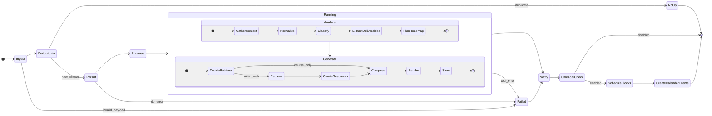

## Agentic Workflow — State Machine (LangGraph-Friendly)

```mermaid
stateDiagram-v2
  direction LR

  [*] --> Ingest
  Ingest --> Deduplicate

  Deduplicate --> NoOp: duplicate
  NoOp --> [*]

  Deduplicate --> Persist: new_version
  Persist --> Enqueue
  Enqueue --> Running

  state Running {
    direction TB
    state Analyze {
      direction LR
      [*] --> GatherContext
      GatherContext --> Normalize
      Normalize --> Classify
      Classify --> ExtractDeliverables
      ExtractDeliverables --> PlanRoadmap
      PlanRoadmap --> [*]
    }
    Analyze --> Generate
    state Generate {
      direction LR
      [*] --> DecideRetrieval
      DecideRetrieval --> Compose: course_only
      DecideRetrieval --> Retrieve: need_web
      Retrieve --> CurateResources
      CurateResources --> Compose
      Compose --> Render
      Render --> Store
      Store --> [*]
    }
  }

  Running --> Notify
  Notify --> CalendarCheck

  CalendarCheck --> [*]: disabled
  CalendarCheck --> ScheduleBlocks: enabled
  ScheduleBlocks --> CreateCalendarEvents
  CreateCalendarEvents --> [*]

  Ingest --> Failed: invalid_payload
  Persist --> Failed: db_error
  Running --> Failed: tool_error
  Failed --> Notify
```
